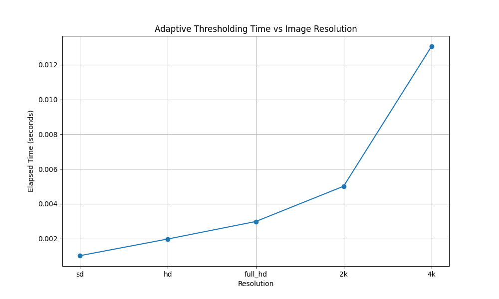
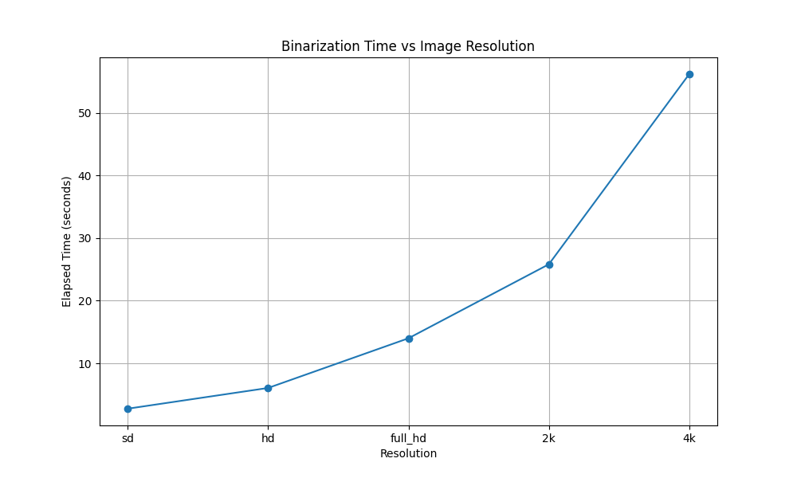

## Бинаризация
Бинаризация — это процесс преобразования изображения в черно-белый формат, в котором пиксели имеют только два значения: 0 (черный) для фона и 255 (белый) для переднего плана. Такой метод используется для выделения объектов на изображении, упрощения анализа и уменьшения объема данных.

На вход программе подается изображение, которое преобразуется в черно-белый формат. 
Программа отображает черно-белое изображение в окне для визуализации результатов бинаризации.

## Описание метода

Бинаризация основывается на выборе порогового значения, используемого для сегментации изображения. Пиксели с интенсивностью выше порога определяются как передний план, остальные — как фон. В данной работе используется метод адаптивной бинаризации с порогами, вычисляемыми локально для каждого региона изображения.

Пороговое значение используется для сегментации изображения путем установки для всех пикселей, 
значения интенсивности которых выше порогового значения, значения переднего плана, 
а для всех оставшихся пикселей значения фона.

## Реализации адаптивной бинаризации

Для сравнения были созданы три варианта реализации алгоритма адаптивной бинаризации:

Библиотечная реализация (lib_binarization.py): Использует функцию из библиотеки OpenCV (cv2.adaptiveThreshold) для быстрой адаптивной бинаризации.

Нативная реализация на Python (our_binarization.py): В этом файле реализована адаптивная бинаризация с использованием скользящего окна, которое проходит по изображению и вычисляет порог для каждого локального окна.
    
## Реализация скользящего окна

В данном скрипте реализовано скользящее окно, вычисляющее локальный порог для каждого пикселя. В каждой позиции окна среднее значение интенсивности пикселей вычисляется и корректируется с учетом параметра C.

```python

 for i in range(h_k - 1, M + h_k):
        for j in range(h_k - 1, N + h_k):
            m = pdimg[i - h_k + 1:i + h_k, j - h_k + 1:j + h_k].mean() - C
            cp_img[i, j] = 0 if pdimg[i, j] < m else 255
    end = time.time()

```

## Сравнение скорости работы алгоритмов

`lib_binarization.py`: 0.013

`our_binarization.py`: 56


Вывод: библиотечная реализация работает значительно быстрее нативной за счет оптимизации алгоритма в OpenCV.

## Результат работы
Исходное изображение:


Результат работы нативной реализации:


