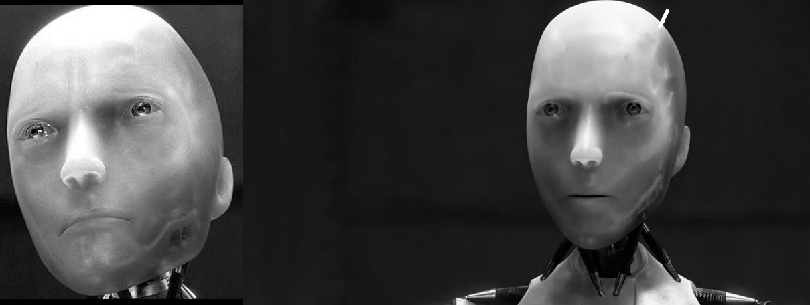

## Цель работы

Реализовать простейшие алгоритмы сопоставления изображений и сравнить их эффективность.

## Описание работы
В данной лабораторной работе реализованы два алгоритма поиска эталона на входном изображении:

Прямой поиск шаблона (Template Matching):
Файл template_match.py содержит реализацию алгоритма, использующего метод скользящего окна.
Программа принимает два изображения (исходное и эталон) и выполняет прямое сопоставление, строя карту совпадений.

Поиск ключевых точек с использованием SIFT:
Файл sift_in_work.py реализует поиск ключевых точек и дескрипторов с использованием алгоритма SIFT.
Выполняется сопоставление ключевых точек двух изображений с построением гомографии для выделения искомого объекта.

## Template Matching

Прямое сопоставление изображений происходит следующим образом:

Программа скользит эталоном по всему изображению.
В каждой позиции вычисляется метрика сходства (например, NCC или SSD).
Координаты с максимальным значением метрики указывают местоположение шаблона.

Особенности:

Простота реализации.
Плохо справляется с масштабированием, поворотами и другими искажениями шаблона.

## SIFT

Этот алгоритм основан на:

Поиске локальных экстремумов в пространстве масштабов.
Описании найденных точек дескрипторами.
Сопоставлении дескрипторов двух изображений.
Построении гомографии для нахождения области совпадения.

Особенности:

Устойчивость к масштабированию, поворотам и частичным изменениям освещения.
Эффективно работает с изображениями с текстурами.

## sift_in_work.py

С помощью реализованного алгоритма SIFT вычисляются ключевые точки и дескрипторы для двух изображений. Для сопоставления точек используется cv2.FlannBasedMatcher, который находит соответствия между дескрипторами эталона и входного изображения. Затем с помощью cv2.findHomography строится матрица гомографии M, определяющая преобразование эталона на исходное изображение. Этот процесс устойчив к выбросам благодаря методу RANSAC.
На финальном этапе прямоугольник эталона преобразуется через cv2.perspectiveTransform, и с использованием cv2.polylines на входное изображение накладывается рамка, показывающая положение найденного объекта. Такой подход позволяет эффективно находить эталон даже при изменении ракурса, масштаба или освещения.
```python
	M, _ = cv2.findHomography(src_pts, dst_pts, cv2.RANSAC, 5.0)

    # Рисование обнаруженного шаблона на сцене
    h, w = img1.shape
    pts = np.float32([[0, 0], [0, h - 1], [w - 1, h - 1], [w - 1, 0]]).reshape(-1, 1, 2)
    dst = cv2.perspectiveTransform(pts, M)
    img2 = cv2.polylines(img2, [np.int32(dst)], True, 255, 3, cv2.LINE_AA)
```

## Результат рабооты

Алгоритм SIFT:
1. 
2. 
3. 
4. 

Алгоритм поиска шаблонов:
1. 
2. 
3. 
4. 

Эксперименты показали, что, при искажении шаблона на изображении, алгоритм поиска шаблонов не находит шаблон на изображении 
