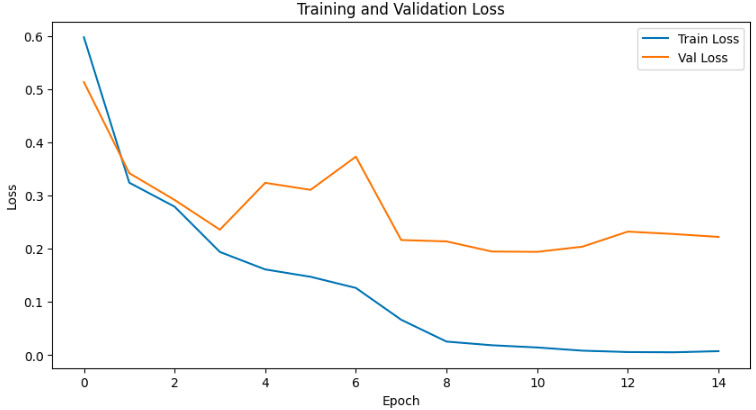
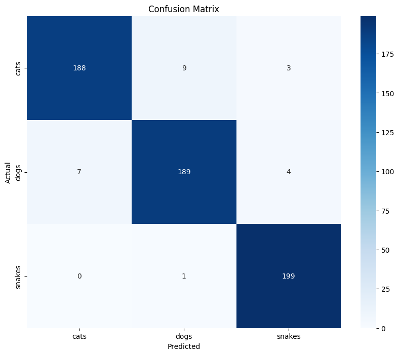

## Теоретическая база

Сверточные нейронные сети широко применяются в задачах компьютерного зрения: классификация, детекция объектов, сегментация и др.
Основная идея свёрточных слоёв – использование фильтров (kernels), которые "сканируют" изображение, извлекая локальные признаки (edges, corners, textures),
а затем более глубокие слои обобщают и комбинируют эти признаки, формируя более сложные абстракции.

## Описание разработанной системы

Алгоритм и принципы работы:

**Выбор задачи классификации и датасета:**

- В данной работе использовался датасет с изображениями животных.
- Данные были взяты с Kaggle: Animal Image Classification Dataset.
- Цель – классифицировать изображения по типу животного.

**Предобработка данных:**

- Датасет был разделен на обучающую и валидационную выборки в соотношении 80/20.

**Модель:**

- Использовалась модель ResNet-50, предобученная на ImageNet.
- На последнем полносвязанном слое была заменена классификационная голова для выдачи вероятностей по количеству классов в нашем датасете.

**Архитектура:**

- Базовая часть: ResNet-50
- Выходной слой: Linear(in_features=2048, out_features=3).

**Оптимизация:**

- Функция потерь: CrossEntropyLoss
- Оптимизатор: Adam (lr=0.001)
- Планировщик (Scheduler): StepLR(step_size=7, gamma=0.1) для уменьшения learning rate во время обучения.

## Результат работы

Обучение проводилось в течение 15 эпох. На каждой эпохе выводилась ошибка (Loss), точность (Accuracy) и, после завершения эпохи, вычислялся F1-score на валидационной выборке.

Примерный ход обучения:

```bash
Epoch 0/14
----------
train Loss: 0.5328 Acc: 0.8013
val Loss: 0.6191 Acc: 0.7633
val F1-Score: 0.7459

Epoch 1/14
----------
train Loss: 0.3215 Acc: 0.8679
val Loss: 0.3906 Acc: 0.8500
val F1-Score: 0.8512

...
Epoch 11/14
----------
train Loss: 0.0142 Acc: 0.9971
val Loss: 0.1456 Acc: 0.9633
val F1-Score: 0.9632

Training complete. Best val F1-Score: 0.9632
```

Наилучший результат по F1-score на валидационной выборке составил примерно 0.9632

График ошибок:



Матрица ошибок (Confusion Matrix):
Для визуализации качества работы модели была построена матрица ошибок, отражающая распределение предсказанных классов относительно истинных. Ниже приведена матрица в виде графика.


## Выводы по работе

Модель показала высокий уровень качества на валидационном датасете (F1-score ~0.96), что говорит о том, что модель успешно справилась с задачей классификации изображений животных.
Также была рассмотрена возможность переобучения: судя по плавному росту точности и высокому качеству на валидационной выборке, значительного переобучения не наблюдается.
